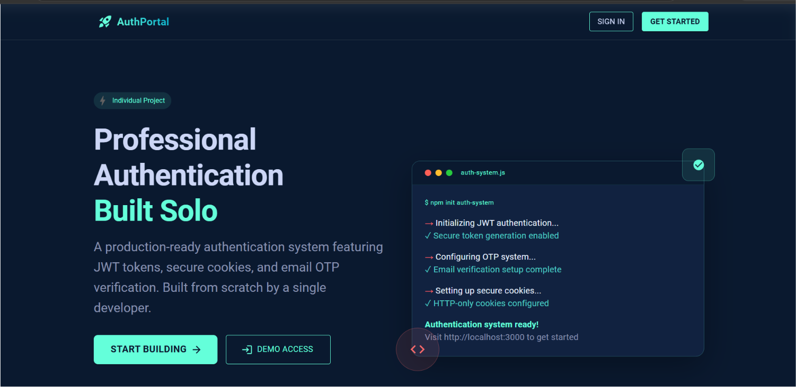

# AuthPortal - Spring Boot JWT Cookie Authentication

An individual full-stack authentication project built with Spring Boot, React, JWT cookies, PostgreSQL, OTP verification, and account management features.

## Project Overview

AuthPortal is an individual full-stack project that I built to practice real-world authentication and user account flows. The main idea is to handle user registration, email verification, login, protected API access, profile management, password recovery, and account deletion in one connected system.

The project uses a Spring Boot backend with PostgreSQL for persistence and a React frontend for the user interface. I focused mostly on authentication, security flow, backend/frontend integration, and keeping the code separated into clear layers instead of putting all logic in one place.

This is not a real-time chat or notification platform. The current version is a REST API based authentication system with dashboard/profile screens and account security features.

## Project Overview Document

I also created a detailed project overview PDF with the landing page screenshot, feature explanations, system flow, backend/frontend structure, API notes, and security implementation details.

PDF: [View Full Project Overview PDF](./docs/project-overview.pdf)

## Landing Page Preview



## Tech Stack

| Layer | Technologies |
| --- | --- |
| Frontend | React 18, Vite, React Router, Axios, Material UI, MUI Icons |
| Backend | Java 21, Spring Boot 4.0.2, Spring MVC, Spring Security, Spring Data JPA, Spring Mail |
| Database | PostgreSQL |
| Authentication | JWT, HttpOnly cookies, Spring Security, BCrypt password hashing, JJWT |
| File / Media Handling | Spring Multipart, local `uploads` storage, `/media/**` resource mapping |
| Real-time | Not implemented in the current codebase |
| Tools | Maven Wrapper, npm, ESLint, Vite |

## Key Features

- **User Registration** - Users can create an account with name, email, phone number, optional backup email, password, and role.
- **Email OTP Verification** - New accounts are created as unverified first, then verified through a 6-digit email code.
- **Login with JWT Cookies** - After login, the backend generates JWT access and refresh tokens and stores them in HttpOnly cookies.
- **Role-Based Access** - Admin endpoints are protected with `ROLE_ADMIN`, while user endpoints require authentication.
- **Profile Management** - Authenticated users can view profile data and update basic account information.
- **Email Update Flow** - Email changes are handled through a temporary email value and OTP verification before replacing the main email.
- **Password Update Flow** - Logged-in users can update their password after confirming the current password.
- **Forgot Password Flow** - Users can recover access using at least two identifiers from email, backup email, and phone number.
- **Account Deletion** - The backend supports password-confirmed deletion and OTP-confirmed deletion.
- **Profile and Cover Photo Uploads** - Users can upload profile and cover images with size/type validation.
- **Frontend Routing and API Integration** - The React app connects to the backend using Axios with credentials enabled for cookie-based auth.

## Advanced Features

### JWT Authentication with HttpOnly Cookies

I used JWT for stateless authentication and stored tokens as HttpOnly cookies. The backend creates access, refresh, and verification tokens with different expiration times. `JWTAuthFilter` reads the token from the `Authorization` header first and then falls back to the access-token cookie.

### Token Validation and Protected APIs

Spring Security validates JWTs before allowing access to protected routes. Public routes are limited to authentication, forgot-password, and public media paths, while `/user/**` requires authentication and `/admin/**` requires the admin role.

### OTP Verification for Registration

During registration, the backend stores the user as unverified, generates a 6-digit verification code, and sends it by email. OTP resend is controlled with resend count and temporary blocking logic to reduce repeated requests.

### Forgot Password Recovery

The forgot-password flow requires at least two matching identifiers from email, backup email, and phone number. After OTP verification, the backend creates a short-lived `VERIFY` token cookie, and only then allows password reset.

### Password and Email Security

Passwords are hashed with BCrypt before saving. Email updates do not replace the main email directly; the new email is stored temporarily and only applied after OTP verification.

### Role-Based Authorization

The backend uses enum roles such as `ROLE_USER`, `ROLE_ADMIN`, and `ROLE_MANAGER`. Admin routes are protected with `@PreAuthorize("hasRole('ADMIN')")`, and user home access is protected with `@PreAuthorize("hasRole('USER')")`.

### File Upload Validation

Profile and cover uploads are checked for file size and allowed image content types. Files are stored under the configured media root directory, and the public media path is stored on the user record.

### Layered Backend Structure

I separated the backend into controllers, services, repositories, entities, records, security, utilities, and exception handling. This keeps request handling, business logic, persistence, and security responsibilities easier to follow.

### Frontend API Handling

The React app uses a shared Axios client with `withCredentials: true`, so browser requests include the auth cookies set by the backend. Most pages use local component state for forms, loading states, and error messages.

### Environment-Based Configuration

The backend configuration supports environment variables for database, email, JWT, cookie, and media settings. This keeps sensitive values out of source code while still allowing simple local defaults.

## System Architecture

```txt
User
  |
  v
React Frontend (Vite)
  |
  | Axios requests with credentials
  v
Spring Boot REST API
  |
  | JWTAuthFilter + Spring Security
  v
Controller Layer
  |
  v
Service Layer / Business Logic
  |
  v
Repository Layer (Spring Data JPA)
  |
  v
PostgreSQL Database
```

### Authentication Flow

```txt
Register
  -> Save unverified user
  -> Generate email OTP
  -> Send verification email
  -> Verify OTP
  -> Mark account as verified
  -> Login
  -> Set ACCESS and REFRESH HttpOnly cookies
  -> Use JWT cookie for protected API requests
```

### Forgot Password Flow

```txt
User provides at least two recovery identifiers
  -> Backend finds a matching user
  -> OTP is generated and saved
  -> OTP is sent through the selected recovery channel
  -> User verifies OTP
  -> Backend creates VERIFY token cookie
  -> User changes password
  -> VERIFY token is removed
```

### File Upload Flow

```txt
Frontend selects profile or cover image
  -> Multipart request to backend
  -> Backend validates size and content type
  -> File is saved under uploads/profile or uploads/cover
  -> Media URL is stored in PostgreSQL
  -> Image is served through /media/**
```

There is no WebSocket, Socket.IO, or SSE layer in this version. All implemented communication is handled through REST endpoints.

## Folder Structure

```txt
springboot-jwt-cookie-auth/
|
|-- README.md
|-- .gitignore
|-- docs/
|   |-- project-overview.pdf
|   `-- images/
|       `-- landing-page.png
|
|-- authen/
|   `-- authen/
|       |-- pom.xml
|       |-- mvnw
|       |-- mvnw.cmd
|       |-- src/
|       |   |-- main/
|       |   |   |-- java/com/authen/authen/
|       |   |   |   |-- config/
|       |   |   |   |-- controller/
|       |   |   |   |-- dtos/
|       |   |   |   |-- entity/
|       |   |   |   |-- enums/
|       |   |   |   |-- exception/
|       |   |   |   |-- records/
|       |   |   |   |-- repository/
|       |   |   |   |-- security/
|       |   |   |   |-- service/
|       |   |   |   `-- util/
|       |   |   `-- resources/
|       |   |       |-- application.yaml
|       |   |       `-- application-example.yaml
|       |   `-- test/
|       `-- HELP.md
|
|-- authfrontend/
|   `-- ui/
|       |-- package.json
|       |-- vite.config.js
|       |-- .env.example
|       `-- src/
|           |-- api.js
|           |-- App.jsx
|           |-- main.jsx
|           `-- components/
|
`-- uploads/
    |-- cover/
    `-- profile/
```

`uploads/` is used for runtime media files. It should stay local/ignored in Git because uploaded user files are generated data, not source code.

## Backend Overview

The backend is a Spring Boot application responsible for authentication, user management, OTP handling, file upload handling, API security, and database persistence. I used a layered structure so each part has a clear responsibility.

- `controller/` contains REST endpoints for auth, forgot password, user actions, and admin dashboard access.
- `service/` contains interfaces and service implementations for authentication and user profile logic.
- `repository/` contains Spring Data JPA repositories for database access.
- `entity/` contains the `User` and `ForgotPassword` JPA entities.
- `security/` contains Spring Security configuration, JWT filter logic, authentication provider setup, and password encoder configuration.
- `util/` contains JWT and email helper logic.
- `exception/` contains global validation/runtime error handling.

The backend uses `SecurityConfig` to disable server sessions and keep the API stateless. `JWTAuthFilter` loads the current user from the JWT and places the authenticated user into the Spring Security context.

## Frontend Overview

The frontend is a React application created with Vite. It uses React Router for page routing, Material UI for most UI components, and Axios for backend communication.

Main frontend routes:

- `/` - Landing page
- `/signup` - Registration form
- `/verify` - Registration OTP verification
- `/login` - Login form
- `/forgot-password` - Forgot password and reset flow
- `/home` - User dashboard/profile summary screen
- `/profile` - Profile page with profile and cover photo upload
- `/settings` - Account settings for name, email, password, and deletion
- `/dashboard` - Admin dashboard page

The frontend does not use Redux or another global state library. I used local React state for forms, messages, loading states, selected files, and page-level data. Protected data is enforced by the backend; frontend pages also redirect to login when protected API calls return unauthorized responses.

The full UI walkthrough is included in the project overview PDF.

## Database Overview

The project uses PostgreSQL with Spring Data JPA. Hibernate is configured with `ddl-auto: update`, so the schema is updated from the JPA entities during local development.

Main entities:

- `User` - Stores user identity, email, phone number, hashed password, role, verification state, refresh token, OTP resend fields, temporary email, and media paths.
- `ForgotPassword` - Stores password recovery OTP data, expiration time, resend tracking, recovery channel, block time, and a one-to-one relationship with `User`.

Main relationship:

```txt
User 1 -------- 1 ForgotPassword
```

The backend uses repositories such as `UserRepo` and `ForgotPasswordRepository` to query users by email, phone number, refresh token, and recovery records.

## Authentication & Security

The authentication flow starts with registration and email verification. Users cannot log in successfully until the account is verified. During login, Spring Security authenticates the email/password combination, then the backend generates JWT tokens and sets them in HttpOnly cookies.

Security-related implementation in this project includes:

- Registration with validation annotations
- Email OTP verification
- OTP resend limit and temporary blocking
- Login through Spring Security authentication manager
- BCrypt password hashing
- JWT access, refresh, and verification tokens
- HttpOnly token cookies
- JWT validation through a custom filter
- Role-based access for user and admin endpoints
- Forgot password with OTP and short-lived verify token
- Password update using current password confirmation
- Account deletion by password or OTP confirmation
- File upload validation for image type and file size
- Global API error handling for validation/runtime errors

Token and OTP timing used in the backend:

- Access token: 25 minutes
- Refresh token: 7 days
- Verify token: 30 minutes
- Registration OTP: 2 minutes
- Forgot-password OTP: 5 minutes
- Account deletion OTP: 10 minutes

Sensitive configuration values such as database passwords, email app passwords, JWT secrets, and API keys should not be committed to GitHub. They should be stored locally using environment variables or ignored configuration files.

## Security & Configuration Notes

This project may require local configuration values such as database credentials, email app passwords, JWT secrets, and other environment-specific settings.

To avoid exposing sensitive data, these files should not be pushed with real values:

- `.env`
- `application.properties`
- `application.yaml`
- `application.yml`
- any local config file that contains passwords or secrets

Instead, keep a safe example file such as:

- `.env.example`
- `application-example.properties`
- `application-example.yaml`

In this repo, `application.yaml` uses environment variable placeholders, and `application-example.yaml` shows the expected configuration format without real secrets.

If a sensitive file was already tracked by Git, remove it from Git tracking without deleting the local file:

```bash
git rm --cached path/to/file
```

Then add the file path to `.gitignore`.

This keeps the local project working while preventing private credentials from being pushed to GitHub.

Example backend environment values:

```env
DB_URL=jdbc:postgresql://localhost:5432/auth_db
DB_USERNAME=postgres
DB_PASSWORD=your_database_password
MAIL_USERNAME=your_email@example.com
MAIL_PASSWORD=your_email_app_password
JWT_SECRET=replace_with_a_long_random_secret
JWT_COOKIE_SECURE=false
JWT_COOKIE_SAME_SITE=Lax
MEDIA_ROOT_DIR=uploads
```

Example frontend environment value:

```env
VITE_API_BASE_URL=http://localhost:8080
```

## API Endpoints

### Authentication

| Method | Endpoint | Description | Auth Required |
| --- | --- | --- | --- |
| POST | `/auth/register` | Register a new user and send verification OTP | No |
| POST | `/auth/login` | Authenticate user and set JWT cookies | No |
| POST | `/auth/verify-code` | Verify registration OTP using `userEmail` cookie | No |
| POST | `/auth/resend-otp` | Resend registration OTP using `userEmail` cookie | No |
| POST | `/auth/logout` | Clear auth and verification cookies | No |

### Forgot Password

| Method | Endpoint | Description | Auth Required |
| --- | --- | --- | --- |
| POST | `/forgotpass/send-otp` | Send recovery OTP after matching at least two identifiers | No |
| POST | `/forgotpass/resend-otp` | Resend recovery OTP with resend limit handling | No |
| POST | `/forgotpass/verify-otp` | Verify recovery OTP and set `VERIFY` token cookie | No |
| POST | `/forgotpass/change-password` | Change password using the `VERIFY` token cookie | Verify token |

### User

| Method | Endpoint | Description | Auth Required |
| --- | --- | --- | --- |
| GET | `/user/me` | Get authenticated user profile | Yes |
| PUT | `/user/update-name` | Update first name and last name | Yes |
| PUT | `/user/update-email` | Request email change and send OTP | Yes |
| POST | `/user/verify-new-email` | Verify OTP and apply new email | Yes |
| PUT | `/user/update-password` | Update password using current password | Yes |
| GET | `/user/home` | Get user home summary | Yes, `ROLE_USER` |
| DELETE | `/user/delete` | Delete account using current password | Yes |
| POST | `/user/delete-forgot-request` | Send OTP for account deletion | Yes |
| POST | `/user/delete-forgot-verify` | Verify deletion OTP and delete account | Yes |
| POST | `/user/me/profile-photo` | Upload profile photo | Yes |
| POST | `/user/me/cover-photo` | Upload cover photo | Yes |
| GET | `/user/me/profile-photo` | Read profile photo bytes | Yes |
| GET | `/user/me/cover-photo` | Read cover photo bytes | Yes |

### Admin and Media

| Method | Endpoint | Description | Auth Required |
| --- | --- | --- | --- |
| GET | `/admin/dashboard` | Get admin dashboard summary | Yes, `ROLE_ADMIN` |
| GET | `/media/**` | Serve stored uploaded media files | No |

## Installation & Setup Guide

### Prerequisites

- Java 21
- PostgreSQL
- Node.js and npm
- Maven Wrapper is included in the backend folder
- Gmail app password or SMTP credentials if email OTP sending is required

### Clone the Repository

```bash
git clone <repo-url>
cd springboot-jwt-cookie-auth
```

### Database Setup

Create a PostgreSQL database:

```sql
CREATE DATABASE auth_db;
```

Set your local database credentials through environment variables or a local ignored config file.

### Backend Setup

```bash
cd authen/authen
```

On Windows:

```bash
mvnw.cmd spring-boot:run
```

On macOS/Linux:

```bash
./mvnw spring-boot:run
```

The backend runs on:

```txt
http://localhost:8080
```

### Frontend Setup

```bash
cd authfrontend/ui
npm install
npm run dev
```

The frontend runs on:

```txt
http://localhost:5173
```

### Environment Setup

Backend values can be provided as environment variables:

```env
DB_URL=jdbc:postgresql://localhost:5432/auth_db
DB_USERNAME=postgres
DB_PASSWORD=your_database_password
MAIL_USERNAME=your_email@example.com
MAIL_PASSWORD=your_email_app_password
JWT_SECRET=replace_with_a_long_random_secret
JWT_COOKIE_SECURE=false
JWT_COOKIE_SAME_SITE=Lax
MEDIA_ROOT_DIR=uploads
```

Frontend value:

```env
VITE_API_BASE_URL=http://localhost:8080
```

## UI Screenshots

The full UI walkthrough with screenshots and feature explanations is available in the project overview PDF.

PDF: [View Full Project Overview PDF](./docs/project-overview.pdf)

## Project Documentation PDF Explanation

The PDF document includes the project overview, landing page preview, feature explanations, workflow details, API summary, and technical implementation notes. I kept the README focused on setup, architecture, and code-level details, while the PDF gives a more visual explanation of the system.

## Challenges & What I Learned

While building this project, I improved my understanding of connecting a React frontend with a Spring Boot backend, handling authentication with cookies, protecting APIs with JWT validation, and designing account recovery flows with OTP verification.

I also worked through practical problems like keeping uploaded files separate from source code, separating backend logic into layers, validating forms on both sides, and keeping sensitive configuration out of Git. The project helped me understand that authentication is not just login and register; it also includes verification, recovery, account updates, error handling, and safe configuration.

## Future Improvements

- Add automated backend tests for auth, OTP, password reset, and upload flows.
- Improve frontend route protection with a dedicated protected route component.
- Align the profile edit dialog with the existing backend update endpoints.
- Add refresh-token rotation or server-side refresh-token invalidation.
- Add better logging for security events and failed recovery attempts.
- Prepare deployment configuration for production environments.

## About This Project

This project was built as my individual full-stack project to improve my practical development skills. Through it, I worked with frontend development, backend API design, PostgreSQL integration, JWT authentication, OTP-based security flows, file upload handling, and cleaner project organization.
